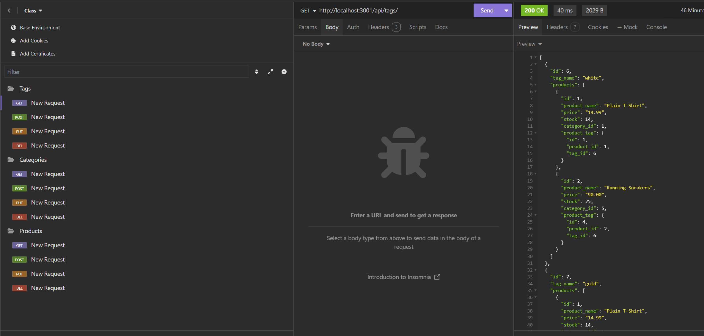

# E-commerce-back-end
<div align="center">

  <!-- Add badges using the following format: -->
  <!-- (urlToGithubHere) -->

[](https://opensource.org/licenses/MIT)
[](https://github.com/AllredW/E-commerce-back-end/graphs/contributors)
[](https://github.com/AllredW/E-commerce-back-end/issues)
[](https://linkedin.com/in/in/william-allred-6a2a522b3/)

</div>

  <h3 align="center">E-Commerce Back-End</h3>

  <p align="center">
 <br />
    <a href="https://github.com/AllredW/E-commerce-back-end"><strong>Explore the docs »</strong></a>
    <br />
    <br />
    ·
    <a href="https://github.com/AllredW/E-commerce-back-end/issues">Report Bug</a>
    ·
    <a href="https://github.com/AllredW/E-commerce-back-end/issues">Request Feature</a>

  </p>
</div>

<!-- TABLE OF CONTENTS -->
<details>
  <summary>Table of Contents</summary>
  <ol>
    <li>
      <a href="#about-the-project">About The Project</a>
      <ul>
        <li><a href="#built-with">Built With</a></li>
      </ul>
    </li>
    <li>
      <a href="#getting-started">Getting Started</a>
      <ul>
        <li><a href="#installation">Installation</a></li>
      </ul>
    </li>
    <li><a href="#usage">Usage</a></li>
    <li><a href="#roadmap">Roadmap</a></li>
    <li><a href="#contributing">Contributing</a></li>
    <li><a href="#license">License</a></li>
    <li><a href="#contact">Contact</a></li>
    <li><a href="#acknowledgments">Acknowledgments</a></li>
  </ol>
</details>

<!-- ABOUT THE PROJECT -->

## About The Project

This application generates a database of products, to be used as the back end of an online retail website. Items can be organized into a range of tables, assigned tags and custom properties, and can be created or deleted from the database as neded.

This is a back-end application, intended to be linked to a front-end framework. The application can be tested using Insomnia to run API requests with the provided code.
   
### Built With

<div align="center">

[](https://javascript.info/)

[](https://www.postgresql.org/docs/)

[](https://dev.java/learn/)

[](https://www.npmjs.com/)

[](https://code.visualstudio.com/docs)

[](https://expressjs.com/)

</div>

### Local Installation / Usage

1. Clone the rep

```
git clone https://github.com/AllredW/E-commerce-back-end.git
```

2. This application utilizes NPM modules Inquirer and pg to function. To ensure that NPM is properly installed in the terminal, it is recommended that the user open a terminal within their IDE and run the command "npm i".

3. In your terminal and run the following command to begin the function:

```
npm start
```

4. Once the database and server are running, the database can be contacted with API requests, using an API program such as Insomnia, or by connecting the database to another program. The code is set up to take in GET, POST, PUT, and DELETE requests to the products, categories, and tags tables.

<!-- USAGE EXAMPLES -->

## Usage

</img>

A link to the demonstration video can also be viewed here: https://www.youtube.com/watch?v=nGS1UTstRHw

<!-- CONTRIBUTING -->

## Contributing

Contributions are what make the open source community such an amazing place to learn, inspire, and create. Any contributions you make are **greatly appreciated**.

If you have a suggestion that would make this better, please fork the repo and create a pull request. You can also simply open an issue with the tag "enhancement".
Don't forget to give the project a star! Thanks again!

1. Fork the Project
2. Create your Feature Branch (git checkout -b feature/AmazingFeature)
3. Commit your Changes (git commit -m 'Add some AmazingFeature')
4. Push to the Branch (git push origin feature/AmazingFeature)
5. Open a Pull Request

<!-- LICENSE -->

## License

This project is licensed under the MIT license.

See LICENSE.txt for more information.

<!-- CONTACT -->

## Contact

[William Allred](https://github.com/AllredW) - allrewil@gmail.com

[Github Repository](https://github.com/AllredW/E-commerce-back-end)